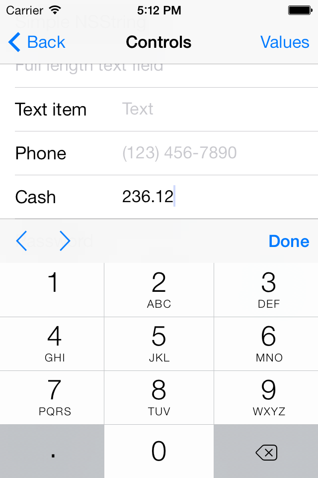

forked from [romaonthego/RETableViewManager](https://github.com/romaonthego/RETableViewManager)

#Install

		pod “RETableViewManager”, :git => "https://github.com/eleven-huang/RETableViewManager.git"
		
#Changes
##1. Add REFloatingNumberItem
You may need to input floating numbers sometimes, such as cash, bitcoin.
		
		
		self.floatingNumberItem = [REFloatingNumberItem itemWithTitle:@"Cash" value:@"" placeholder:@"＄"];

##2. Can disable editting on textfield now

		self.textItem = [RETextItem itemWithTitle:@"Text item" value:nil placeholder:@"Text"];
		self.textItem.disable = YES;